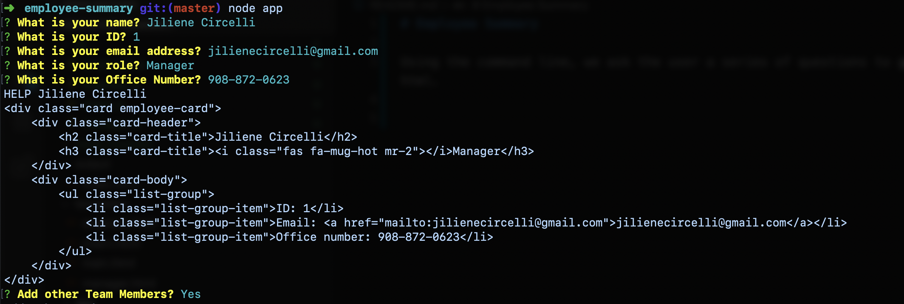
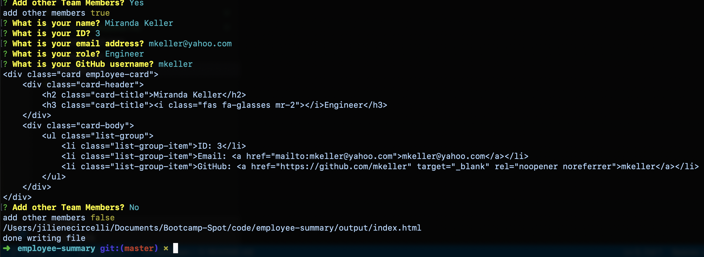

# Employee Summary

Using the command line, we ask the user a series of questions to generate a Team Profile page in html. Following a User Story:

```
As a manager
I want to generate a webpage that displays my team's basic info
so that I have quick access to emails and GitHub profiles
```

How do you deliver this?

* Using the [Inquirer npm package](https://github.com/SBoudrias/Inquirer.js/), we prompted the user for their email, id, and specific information based on their role with the company. For instance, an intern may provide their school, whereas an engineer may provide their GitHub username.

* The app runs as a Node CLI to gather information about each employee.

* Below is some screen shots of what the application looks like in action. 


